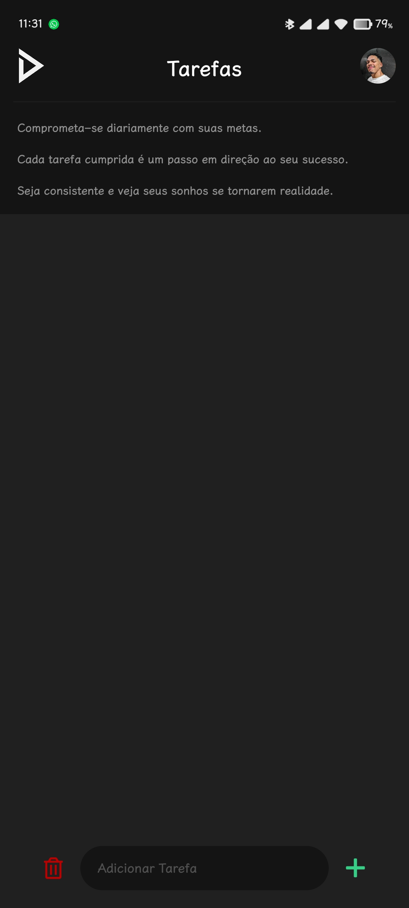
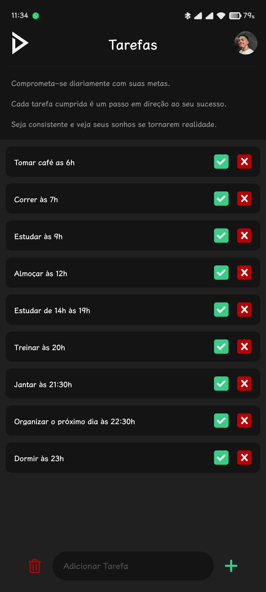
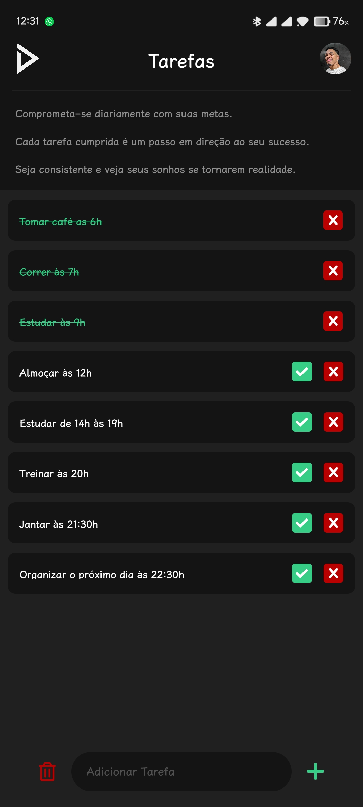
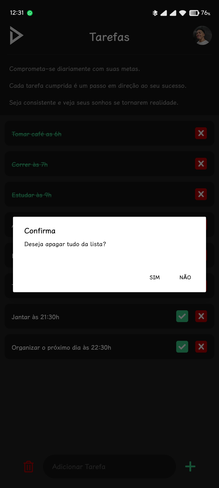

<h1 align='center'>
 <p>Todo List 📝</p>
</h1>


### 📕 About

Daily task management app offers
a minimalist and intuitive interface, in
dark pattern with options to add,
Mark and clear tasks. Developed in
React Native and TypeScript, with
local storage using Async Storage,
the application is available as APK for
Android devices (distributed to
friends).

##

<div align="center">




</div>

##
### ❓ Why the app

I'm at a very productive moment in my life, where I decided to create an app that would help me keep my day organized and avoid procrastination. Thus becoming an essential part of my day, simplifying the organization and monitoring of my daily activities.

&nbsp;
### ⛏️ Tools used

- [Npm](https://docs.npmjs.com/)
- [Expo](https://docs.expo.dev/)
- [TypeScript](https://www.typescriptlang.org/docs/)
- [React Native](https://reactnative.dev/docs/getting-started)

&nbsp;
### 🤝🏽 How to contribute

You need to have [Node](https://nodejs.org/en/download), [Git](https://git-scm.com/download/win) and [VsCode](https://code.visualstudio.com/download) installed on your computer.

And to run the application, simply download [Expo Go](https://play.google.com/store/apps/details?id=host.exp.exponent&hl=pt_BR&gl=US) on your smartphone.

Or install the [Android emulator](https://developer.android.com/studio?hl=pt-br) on your computer and download Expo Go from the Play Store using the emulator.

#### Siga o passo a passo:

````bash
    # Clone the project
    $ git clone git@github.com:dan-ia/TodoList.git

    # Enter directory
    $ cd TodoList
````
````bash
    # Install the dependencies, if use npm
    $ npm install
````
<p align="center">or</p>

````bash
    # Install the dependencies, if use yarn
    $ yarn
````

```` bash
     # Open project in VsCode
     code .

     # Start server
     npx expo start
````
<div align="center">

<h3> Any questions? Contact me! 🩵✌️</h3>

[](https://www.linkedin.com/in/dan-ia/)
[](mailto:danieillsilvarv411@gmail.com)


</div>

